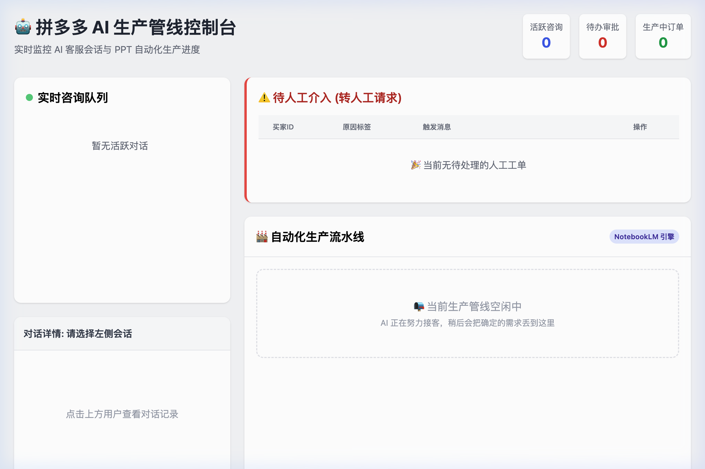

<div align="center">

# 🤖 PDD AI 电商客服机器人

**拼多多 · 智能客服 + 生产流水线 + 人工干预池 · 一体化管理平台**

[](https://python.org)
[](https://fastapi.tiangolo.com)
[](https://trychroma.com)
[](LICENSE)
[]()

</div>

---

## 📖 项目简介

**PDD AI Bot** 是一套专为拼多多电商平台打造的全栈智能客服系统。它将 **大语言模型（LLM）** 与 **RAG 检索增强生成** 深度融合，配备精美的 Web 管理控制台，使商家能以极低成本实现 7×24 小时自动客服，并无缝衔接人工干预。

> 项目已在实际生产环境稳定运行，支持同时服务多个并发买家咨询。

## ✨ 核心功能

| 功能模块 | 描述 |
|---|---|
| 🧠 **RAG 智能问答** | ChromaDB 向量库 + GLM 大模型，精准检索商品知识、FAQ、政策文档 |
| 🔄 **多 Key 熔断机制** | 多 API Key 轮询 + 指数退避重试，高峰期不宕机 |
| 📊 **实时监控大屏** | Vue3 驱动的动态控制台，3s 轮询刷新所有核心指标 |
| 🚨 **人工干预池** | 自动识别投诉/砍价/大额订单，一键接单・标记完成 |
| 🏭 **PPT 生产流水线** | 与 NotebookLM 打通（Playwright 自动化），全程追踪生产状态 |
| 📚 **知识库管理 UI** | 在线新增/删除 RAG 知识片段，无需运行脚本 |
| 🔐 **HTTP Basic Auth** | 管理后台受 Basic Auth 保护，开箱即用的安全层 |
| 🗃️ **SQLite WAL 并发** | WAL 模式 + busy_timeout，高并发读写无锁死 |

---

## 🏗️ 技术架构

```
┌──────────────────────────────────────────────────────────────┐
│               拼多多卖家平台 / Webhook 推送                    │
└───────────────────────────┬──────────────────────────────────┘
                            │ POST /webhook
                            ▼
┌──────────────────────────────────────────────────────────────┐
│                   FastAPI  Application                        │
│  ┌───────────┐  ┌──────────────┐  ┌─────────────────────┐   │
│  │  Webhook  │  │  Dashboard   │  │   Admin API          │   │
│  │  Router   │  │  Router      │  │   Router             │   │
│  └─────┬─────┘  └──────────────┘  └─────────────────────┘   │
│        │                                                       │
│        ▼                                                       │
│  ┌──────────────────────────────────────────────────────┐    │
│  │              Core Pipeline                            │    │
│  │  SessionManager → EscalationDetector → LLMClient     │    │
│  │                        ↕                              │    │
│  │               RAGEngine (ChromaDB)                    │    │
│  └──────────────────────────────────────────────────────┘    │
│        │                                                       │
│        ▼                                                       │
│  ┌──────────────┐    ┌──────────────┐    ┌────────────────┐  │
│  │  SQLite WAL  │    │  ChromaDB    │    │  RQ Task Queue │  │
│  │  (Sessions,  │    │  (Vectors)   │    │  (PPT 异步生产) │  │
│  │   Orders,    │    │              │    │                │  │
│  │  Escalations)│    │              │    │                │  │
│  └──────────────┘    └──────────────┘    └────────────────┘  │
└──────────────────────────────────────────────────────────────┘
```

**技术选型**

| 层级 | 技术 |
|---|---|
| Web 框架 | FastAPI + Uvicorn |
| 大模型 | 智谱 GLM-4 / DeepSeek / Gemini（可切换）|
| 向量检索 | ChromaDB + 智谱 Embedding-3 |
| 关系数据库 | SQLite（WAL 模式）|
| 任务队列 | Redis + RQ |
| 前端 | Vue 3 (CDN) + Tailwind CSS |
| 自动化 | Playwright（NotebookLM 操控）|

---

## 📂 目录结构

```
pdd-ecommerce-bot/
├── config/
│   └── settings.py          # Pydantic Settings，读取 .env
├── data/
│   ├── chroma/              # ChromaDB 向量存储
│   ├── sqlite/              # SQLite 数据库
│   └── knowledge/           # RAG 源文档（Markdown）
├── docs/
│   ├── design-system.md     # 前端设计规范
│   └── screenshot-v1-...    # 控制台截图
├── scripts/
│   ├── load_knowledge.py    # 批量加载知识到 ChromaDB
│   ├── auth_notebooklm.py   # Playwright 登录 NotebookLM（首次运行）
│   └── create_launcher_app.sh
├── src/
│   ├── api/
│   │   ├── webhook.py       # PDD Webhook 接收 & 处理
│   │   ├── dashboard.py     # 实时监控大屏 API
│   │   └── admin.py         # 管理后台 API（知识库/升级/统计）
│   ├── core/
│   │   ├── llm_client.py    # LLM 多 Key 熔断 + 重试
│   │   ├── rag_engine.py    # ChromaDB 检索 + 相关性阈值过滤
│   │   ├── session_manager.py  # 多用户会话隔离（线程安全）
│   │   └── escalation_detector.py  # 投诉/砍价意图识别
│   ├── models/
│   │   └── database.py      # SQLAlchemy 模型（Session/Message/Escalation/Order）
│   ├── services/
│   │   ├── db_service.py    # 数据库 CRUD 服务层
│   │   ├── task_coordinator.py  # PPT 生产流程编排
│   │   ├── notebooklm_playwright.py  # Playwright 自动化
│   │   └── pdd_api_client.py  # PDD 开放平台API（主动消息）
│   └── utils/
│       ├── auth.py          # HTTP Basic Auth 工具
│       └── logger.py        # 结构化日志
├── templates/
│   ├── dashboard.html       # 主控制台（侧边栏布局）
│   └── admin.html           # 老版管理后台（兼容入口）
├── .env.example             # 环境变量模板
├── launch.sh                # 一键启动/停止/重启脚本
├── main.py                  # FastAPI 应用入口
├── worker.py                # RQ Worker 入口
└── requirements.txt
```

---

## 🚀 快速启动

### 1. 安装依赖

```bash
git clone https://github.com/daxia778/pdd-ecommerce-bot.git
cd pdd-ecommerce-bot
python -m venv venv
source venv/bin/activate
pip install -r requirements.txt
```

### 2. 配置环境变量

```bash
cp .env.example .env
# 编辑 .env，填入 API Keys 和 Admin 密码
```

`.env` 关键配置项：

```env
# LLM - 支持逗号分隔多个 Key（自动轮询）
ZHIPU_API_KEYS=key1,key2,key3

# 管理后台登录
ADMIN_USERNAME=admin
ADMIN_PASSWORD=your_strong_password

# PDD 开放平台（可选，用于主动发消息）
PDD_APP_KEY=
PDD_APP_SECRET=
PDD_ACCESS_TOKEN=
```

### 3. 加载知识库

```bash
python scripts/load_knowledge.py
```

### 4. 启动服务

```bash
# 直接启动（开发）
./launch.sh start

# 查看状态
./launch.sh status

# 重启
./launch.sh restart
```

服务启动后访问：
- 🖥️ **管理控制台**：`http://localhost:8100/` （需 Basic Auth）
- 📋 **API 文档**：`http://localhost:8100/docs`
- 🏥 **健康检查**：`http://localhost:8100/health`

---

## 🖼️ 界面截图

> 管理控制台 — 持久侧边栏布局，实时轮询刷新。



---

## 🧠 RAG 工作原理

```
买家消息
    │
    ▼
Embedding（文字 → 向量）
    │
    ▼
ChromaDB 相似度检索（Top-3，阈值 ≥ 0.3）
    │
    ├── 匹配到知识 ──► [系统人设] + [知识片段] + [近10轮对话] + [买家消息]
    │                          │
    │                      GLM-4 Flash
    │                          │
    └── 无匹配     ──►       回复买家
```

**核心优势：**
- 📉 **极低 Token 消耗**：仅将相关知识注入 Prompt
- 🔄 **持续学习**：管理后台直接在线添加新知识，无需重启
- 🎯 **相关性过滤**：低于阈值（默认 0.3）的噪音片段自动排除

---

## 🛡️ 人工干预机制

系统基于关键词 + 语义分析，自动识别以下场景并转人工：

| 触发类型 | 示例关键词 |
|---|---|
| 🚨 紧急投诉 | 投诉、曝光、12315、消费者协会 |
| 💰 砍价/价格纠纷 | 便宜点、打折、少一点 |
| 📦 大额订单 | 批发、团购、几百件 |
| 📵 要求工作人员 | 人工、真人、客服 |
| ⚙️ 系统异常 | AI 回复连续失败 |

所有转人工记录在控制台「人工干预池」面板可视化管理，支持**接单 → 处理 → 完结**完整状态流转。

---

## 📋 环境要求

- Python 3.10+
- Redis（用于任务队列，可选）
- 智谱 API Key（必须）或 DeepSeek / Gemini（二选一）

---

## 🗺️ 项目现状与后续优化路径 (2026-03-06 更新)

### ✅ 当前已实现的核心能力
- **基础对话与持久化**：FastAPI 主干、SQLite WAL 持久化、Session 内存隔离与冷热加载。
- **大模型高可用**：多 API Key 轮询、鉴权失败自动封禁、指数退避重试机制。
- **RAG 知识检索**：ChromaDB 本地向量库 + BAAI Rerank 精排。
- **智能意图分类**：LLM 会话分析 + 投诉/大额订单/降价等规则兜底，精准触发人工介入。
- **全景监控**：Vue3 大屏，集成 WebSocket 实时更新及统计分析。

### 🚀 后续优化与升级路径（分级建议）

**🔴 P0 级修复（阻塞性问题，应优先解决）**
1. 修复 `main.py` 中 `asyncio` 导入顺序导致的潜在生命周期异步预热报错。
2. 修复 `rag_engine.py` 中精排(Rerank)结果未应用相似度阈值过滤的逻辑空洞。
3. 补充 `settings.py` 中多模型（DeepSeek/Gemini）的 Key 列表解析逻辑。

**🟠 P1 级优化（提升系统稳定性与可靠性）**
1. 为 `session_manager.py` 的内存缓冲池加入并发锁（Async Lock），防止高并发读写污染。
2. 将防抖缓存 `_debounce_cache` 从不安全的 `globals()` 注入改为标准的模块级变量。
3. 增加内存限流器 `_rate_limit_store` 的定期过期数据回收机制，防止内存泄漏。
4. 在自动化测试中添加 LLM 调用的 Mock 控制，避免测试消耗真实 Tokens 和触发限频。

**🟡 P2 级增强（业务功能扩展）**
1. **PDD API 正式接入**：在获取到拼多多官方 `app_key`、`app_secret` 与 `access_token` 后，激活 `pdd_api_client.py`，实现真实的 Webhook 消息下发回填。当前该模块跳过真实发送，处于就绪挂起状态。
2. 完善前端构建工作流，实现 Vue3 源码自动构建打包并挂载至 FastAPI 静态目录。
3. 落地知识库文章的“软删除机制”及版本控制记录。

**🔵 P3 级架构演进（长期规划）**
1. 根据会话量级增长情况，将 SQLite 迁移至正式的 **PostgreSQL**。
2. 将当前暂代 Redis 的内存字典缓冲机制替换为真实的 Redis Cluster 方案，实现多实例横向拓展。
3. 增强真实 Webhook 入口的安全校验机制（HMAC 签名校验）。

---

## 📄 License

MIT © 2026 [daxia778](https://github.com/daxia778)
